# Práctica 2 Reingeniería

Se realizó a un proyecto hecho originalmente en `Fox Pro` utiliznado como base de datos un archivos .DBF, se le aplico reingeniería y se cambio a `Python` utilizando como base de datos archivos .csv.

## Prerequisitos

* Python 3

### Ejecutar el proyecto

1. Clonar el repositorio:

``` bash
git clone git@github.com:JuanDiazuwu/reingenieria.git
```

2. Entrar a la carpeta

``` bash
cd reingenieria
```

3. Instalar las librerias:

``` bash
pip install -r requirements.txt
```

4. Ejecutar el archivo main:

``` bash
python main.py
```

## Uso 

Al ejecutar el programa aparecera la siguiente pantalla:

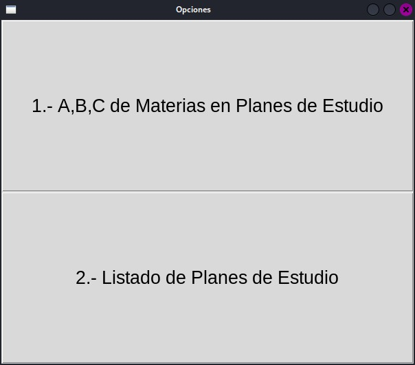

La cual nos da a escoger entre 2 opciones:

* A,B,C de Materias en Planes de Estudio

* Listado de Planes de Estudio

La primera siento un `crud` de materias (abrir(obtener), borrar, y crear), y la segunda opción obtiene los planes de estudios que con los que se cuentan.

### A, B, C de Materias

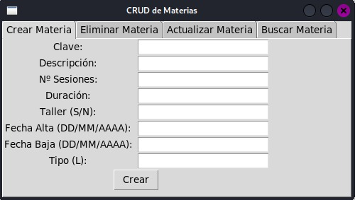

Esta pantalla cuenta con 4 opciones relacionadas con las materias en la parte superior:

* Crear

* Eliminar

* Actualizar

* Buscar 

#### Ejemplo de creacion de materia

Crearemos una materia que tenga la clave `524`, con el nombre de `Ingenieria de Software II`, agregando los datos adicionales.

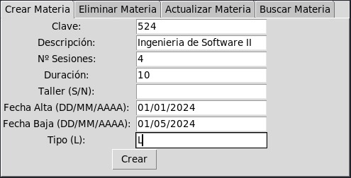

Se crea y para corroborar de que si se allá creado correctamente, utilizamos el panel de `Buscar Materia`.

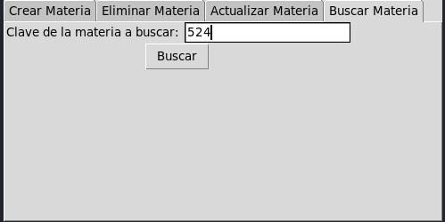

Despliega una nueva pantalla y con toda la información de esa materia.

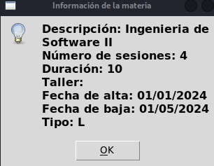

#### Ejemplo edicion de materia

Para editar una materia nos dirijimos al panel de `Actualizar Materia` y aparecera lo siguiente:

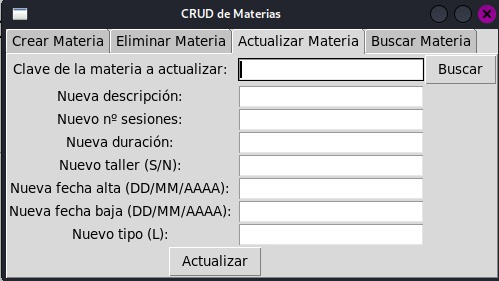

Buscaremos por la clave de la materia que querramos editar, luego daremos click en el botón `Buscar` y rellenara los campos con lo que se tiene actulamente para que podamos editarlo.

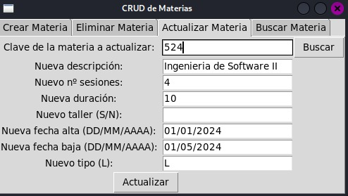

Aqui editaremos el número de sesiones (4 a 6), la duración (10 a 8) y la fecha de alta (01/02/2024).

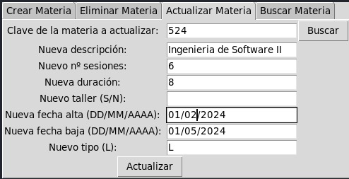

Para corraborar que se actualizo correctamente obtenedremos la materia:

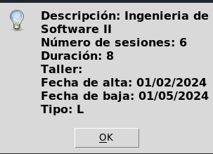

#### Ejemplo de borrar materia

En este caso borraremos la materia recien editada que corresponde a la Clave: 524, y nombre Ingeniería de Software II

No dirigiremos a al panel de `Eliminar materia`:

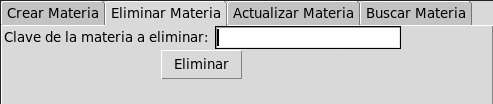

Solo tendremos que colocar el número de clave, y dar click en el botón `Eliminar`:

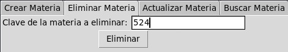

### Listado de Planes de Estudio

Este panel solo muestra los planes con los que se cuenta:

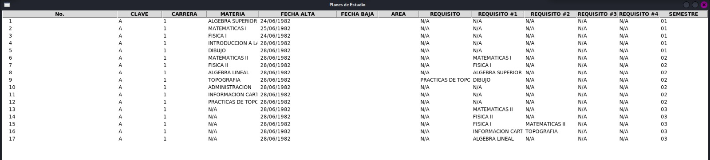